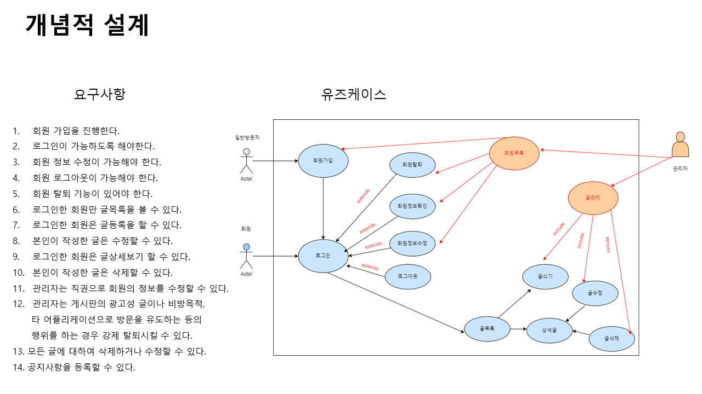
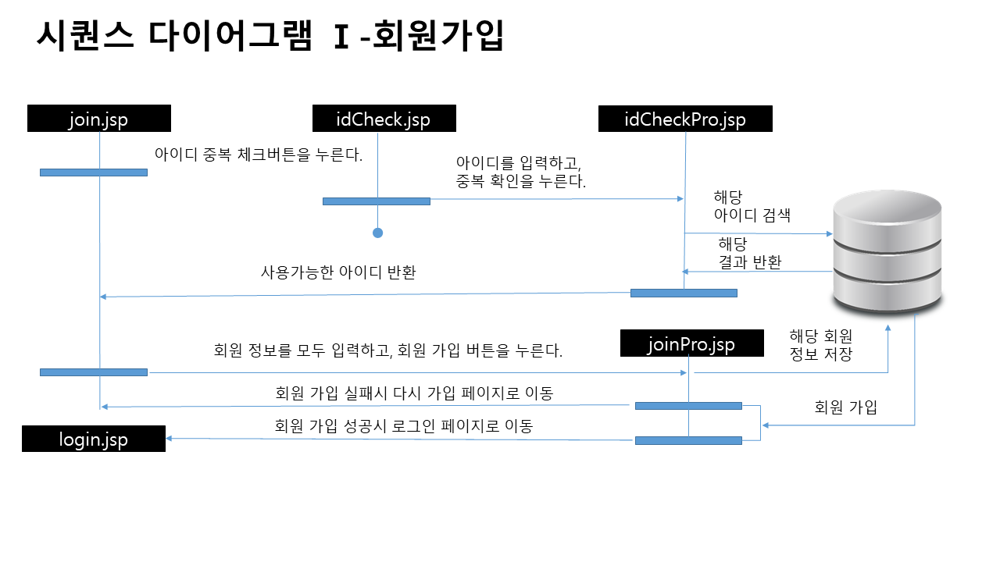
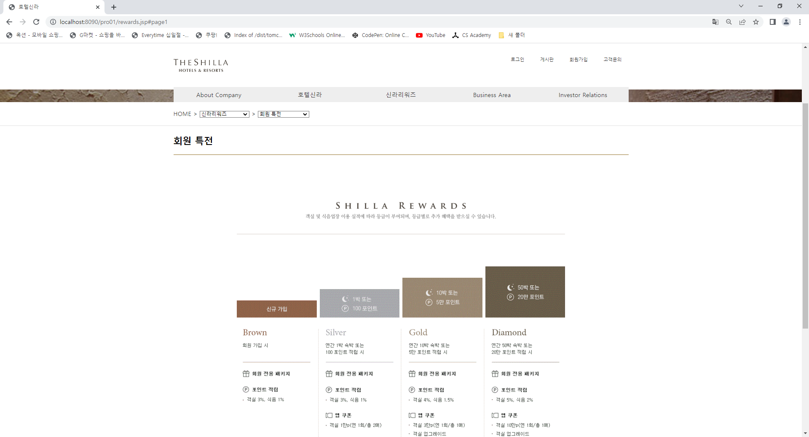

# 프로젝트
## 프로젝트 개요
"호텔 신라" 라는 가상 기업을 주제로 프론트엔드 부분을 설계 시레는 페이퍼 프로포타입으로 사용성을 테스트 한 후, html과 css, javascript로 작성하고,
백엔드 부분은 jsp의 디렉티브, 스크립트릿, 표현식만 활용하여 기업형 데스크탑 웹 어플리케이션을 작성하였으며, 해당 프로젝트는 회원기능인 회원가입, 로그인, 로그아웃, 회원 정보 확인, 회원 정보 수정, 회원 탈퇴, 회원의 게시판 글 목록, 글 상세보기, 글 등록, 글 수정, 글 삭제 등의 기능을 구현하였으며, 관리자는 일반 회원의 관리기능인 회원 정보 수정, 회원 강제 탈퇴, 회원 통계, 글 관리 기능 등을 구현하였음.

## 프로젝트 설계

## 기능 구현

